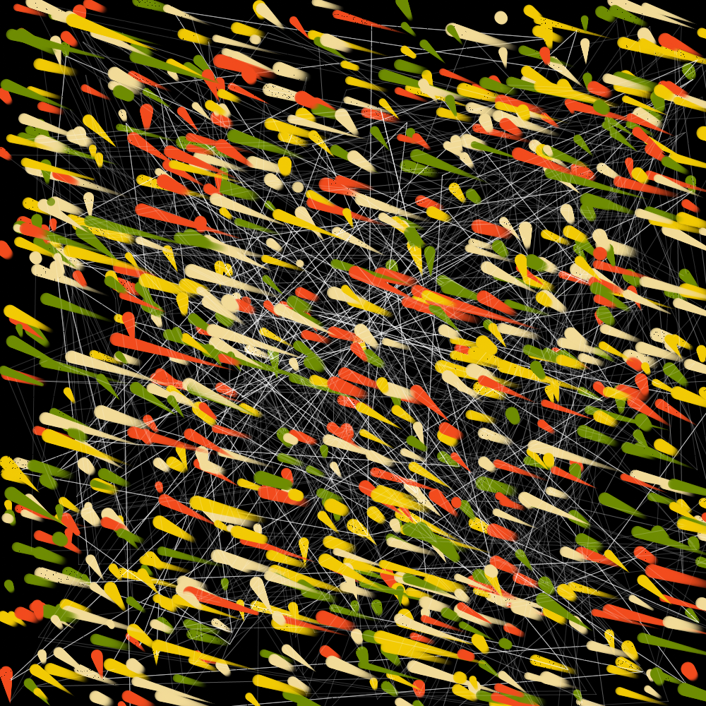
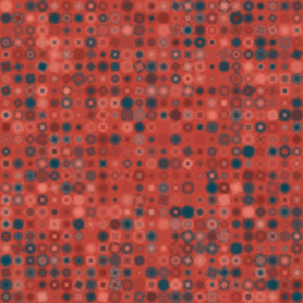
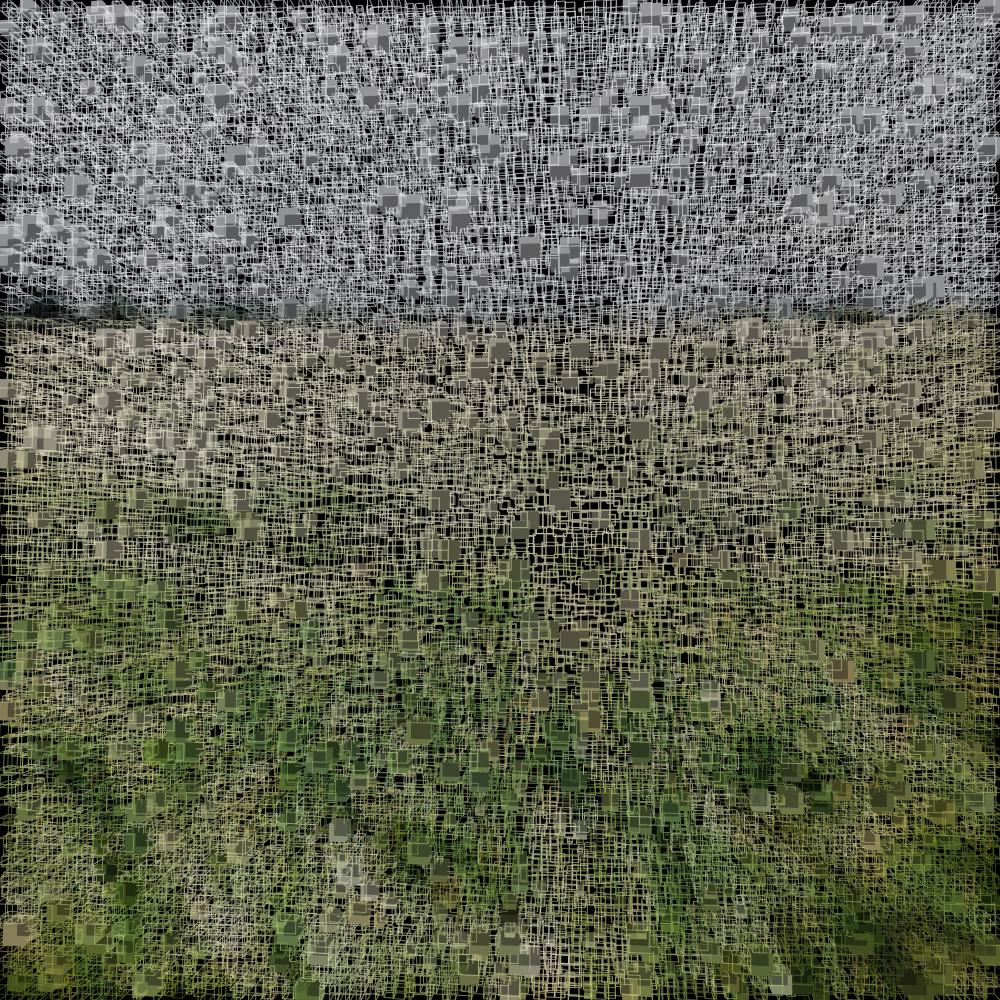

# Processing Experiments 

If you have never used Processing, start  [here](https://www.github.com/cdr6934/AwesomeProcessing)

The following experiments are various creative processing inits I've played with in the past couple of months. Some of them are simply experiments that I've ported from other wonderful peoples. 

Some of the results I have posted on my [Instagram Account](https://www.instagram.com/generate.collective/)

## BrushFade 
Is my most recent and found it to be the most fun to create as it has a number of different elements that I combined to generate. 

## Generative Squares

## Picture Load 

## Social Media 

